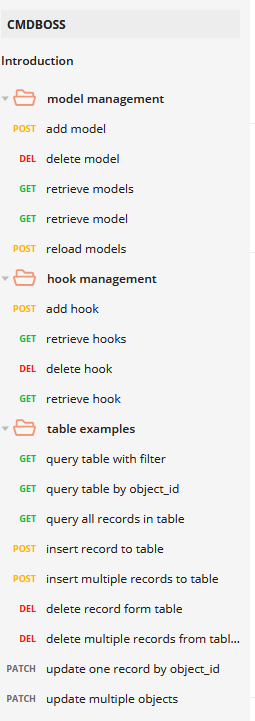

**ReST based nosql database with byo models + hooks that makes configuration management better**


### core features
- Model driven ReST API built on FastAPI backed by a noSQLDB (Mongo)
- BYO Pydantic Models @ Runtime over the rest interface
- Self generating swagger & dynamic endpoints for CRUD operations for all user defined models
- Custom middleware Layer providing async hook capability on DB CRUD operations via a threaded queue
- BYO Python Hooks


### getting started
- git clone the project ``` https://github.com/tbotnz/cmdboss.git ```
- cd into the cmdboss dir ```cd cmdboss ```
  -  Optional (Configure ```config.json```) with your settings
- docker comppose up ```docker-compose up --build```
- access swagger via ```http://127.0.0.1:9000/docs```
- download the online [postman collection](https://documenter.getpostman.com/view/2391814/TzRPjV5h)



#### Roadmap
- GUI for real time model editing
- Add Endpoint Authorisation
- Automate reloading of models
- GraphQL support

You can also find us in the channel #cmdboss on the networktocode Slack.
